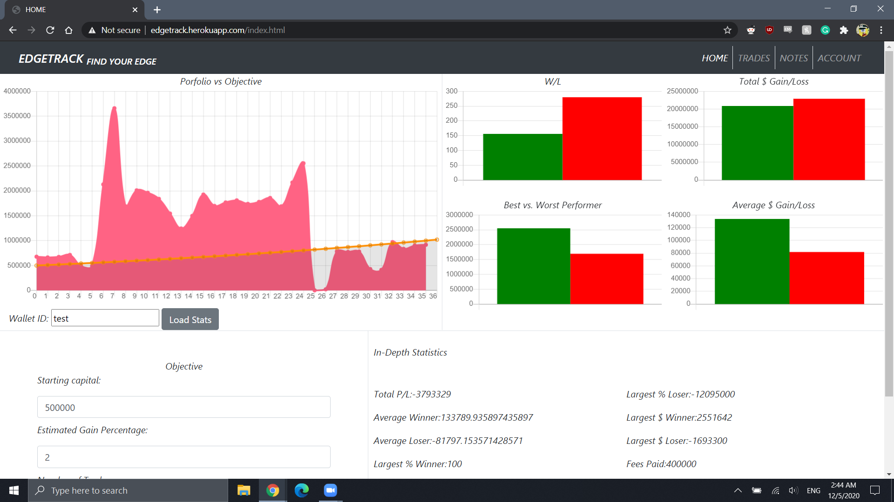
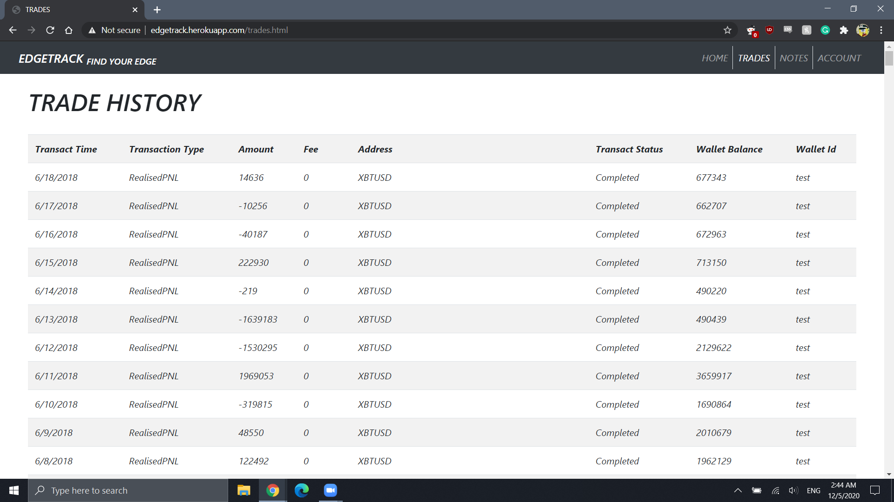
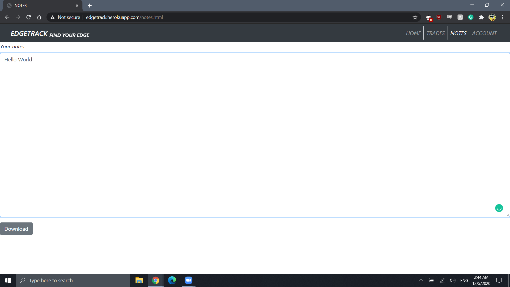
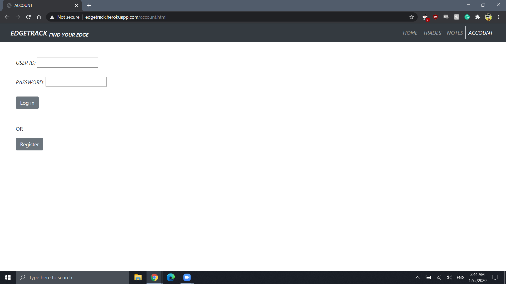
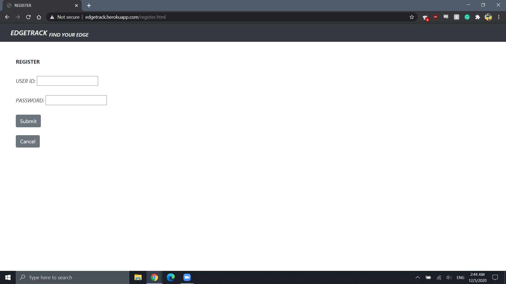
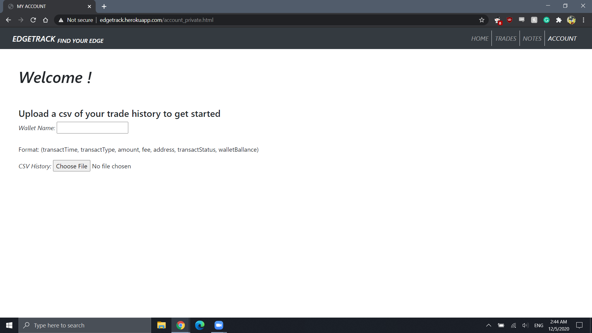

# Upsilon
## Edgetrack

Find Your Edge

## Semester

Fall 2020

## Overview
Edgetrack is a web application that allows active traders to easily track track there performance. Users are able to take a csv file from their exchange and upload it to get a a breakdown of their trading. Edgetrack is innovative because it offers a convenient way for a user to gain insights on their training in a free online package.

## Team Members

Nicholas Szczepura - nszczepura

Kevin Sanchez - knsanchez0001

Eliezer Encarnacion - eliel15000

## User Interface
Home -
Portfolio vs Objective chart

Bar charts
W/L , 
Total $ Gain/Loss, and 
Best vs. Worst performer

In depth-statistics breakdown

Objective settings for performance comparison

Trades -
Table of trade history uploaded by user

Notes - 
A place to write comments for the trading week/month, allows users to download a txt file with their stats and comments for archiving.

Account - 
Log in and register to upload your history and see your stats

## APIs

POST /account

POST /uploadcsv

GET /account

GET /logout

POST /register

GET /register

GET /private

GET /private/:userID/

GET /tradeHistory

GET /walletHistory

GET /winLoss

GET /gainsLosses

GET /avgGainLoss

GET /bestGainWorstLoss

GET /largestPercentWinner

GET /largestPercentLoser

GET /largetsDollarWinner

GET /largestDollarLoser

GET /sumFeesPaid

GET /avgWinner

GET /avgLoser

GET /totalPNL

GET /*

## Database

## URL Routes/Mappings

