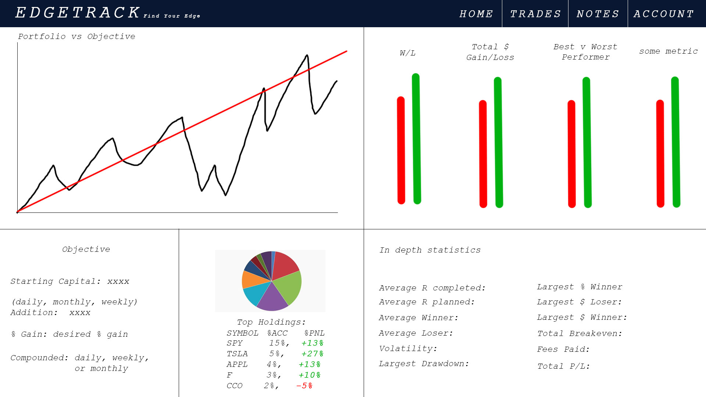
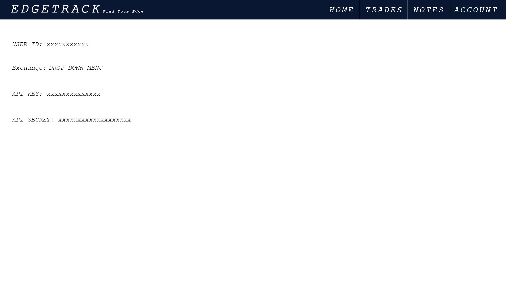
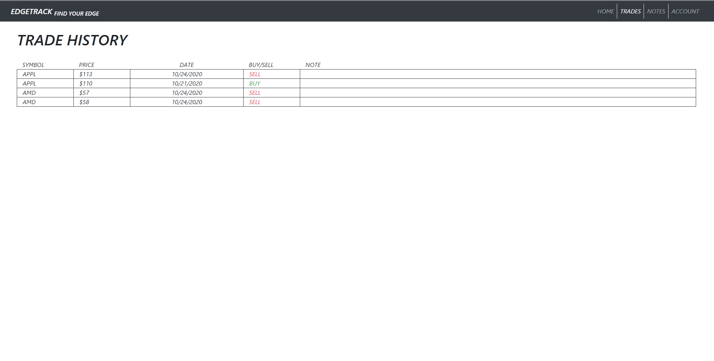
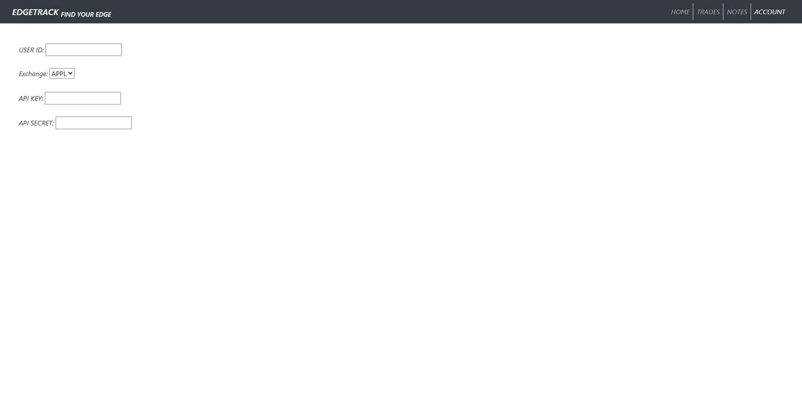
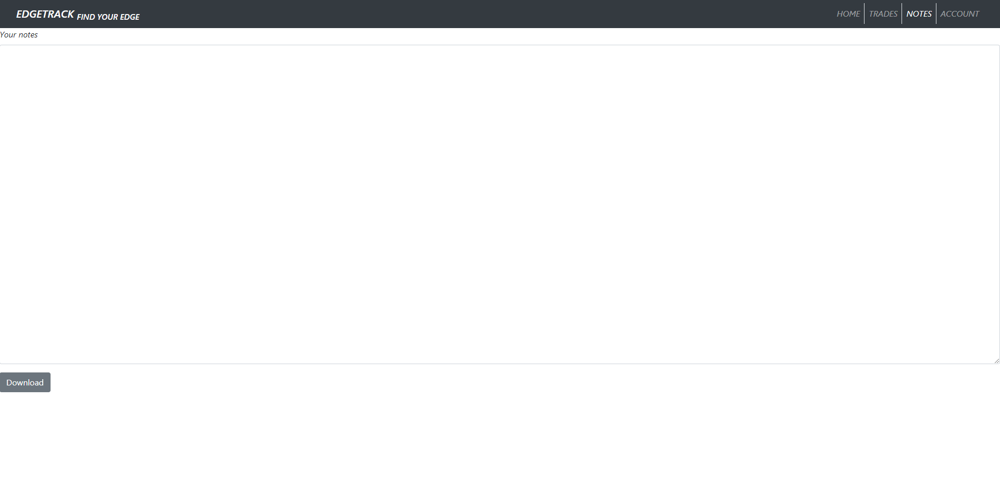

## Wireframes

Home

Trade History

Account

## HTML

Home

Trade History

Account

Notes (once connected to the data the notes page will allow users to download a report with their notes for those who want to keep records)

## Data

Automated trade input -
User's API key
User's API secret
User ID

Performance metrics - 
Generated from data pulled from exchange API

Portfolio vs Reference -
User Objective:
Starting capital
Capital added (daily, weekly, monthly)
Desired % gain
Compounding period (daily, weekly, monthly)

Notes -
Users should be able to write notes and download a report with their notes