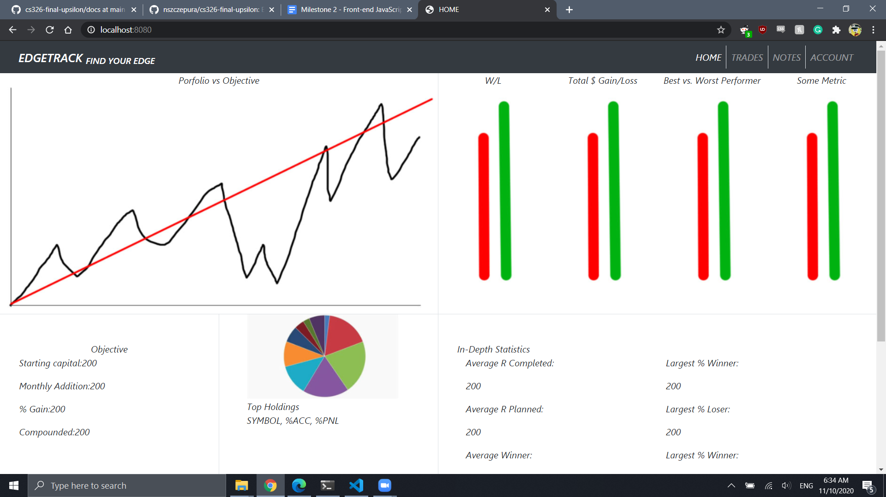
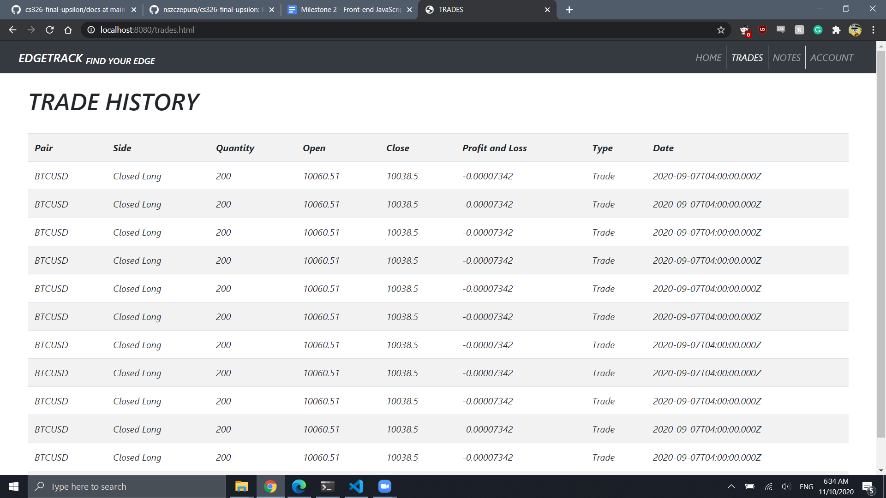
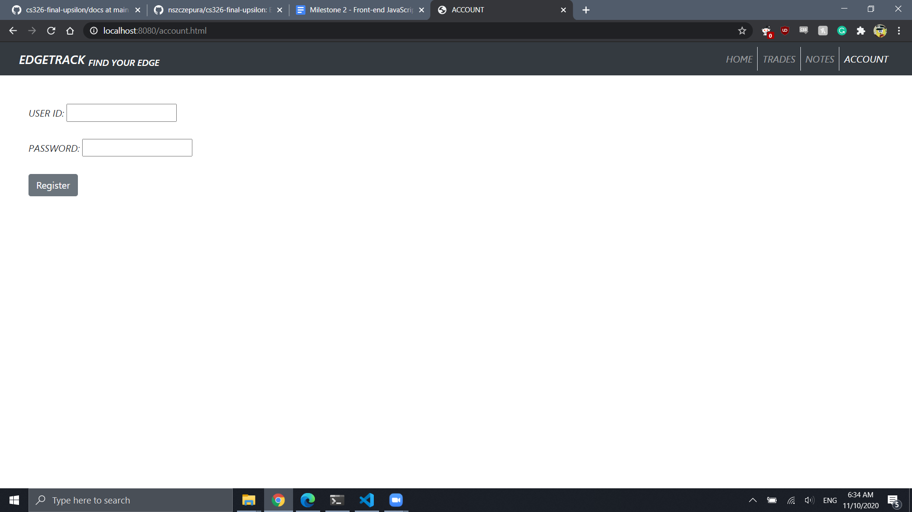

## Home

GETS information from dummy data to present on home page

## Trade History

GETS information from dummy data to present on a trade history table

## Account

POSTS a new user name and password for registration

Nicolas started up the server, Eliezer worked on front end for Account and Notes, Kevin worked on front end for Home and Trade History
